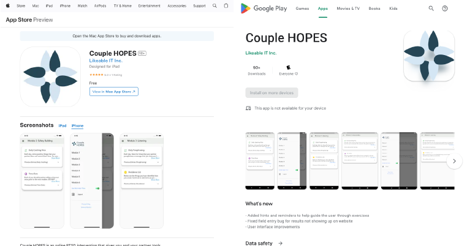

# Product Page Content

---

## Objective

Create the product page content for a mental health startup app.

## Context

While [working at the TULiP Lab](../resume/#project-manager-tulip-lab-at-york-university) as a project manager, I was collaborating on an online mental health program called Couple HOPES.The team developed a companion app to go with the web platform, and I was tasked with creating the app store product page content. Following the App Store and Google Play style guidelines, I crafted all elements of the product pages to spec, including the description, screenshots and logo.

## Achievements

I collaborated with clinical psychologists and developers on the team to understand the key features of the app, how it is meant to be used as a companion app to the Couple HOPES web platform, and how users can gain access to the app.

## Links

[App Store Product Page](https://apps.apple.com/ca/app/couple-hopes/id1500199636){:target="_blank"}

[Google Play Product Page](https://play.google.com/store/apps/details?id=com.couplehopes&hl=en_US&gl=US){:target="_blank"}
