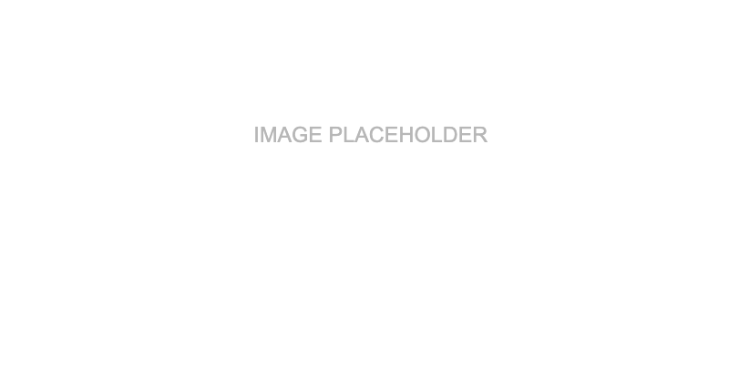

# Portfolio Sample Template

Redesigned and developed the [Couple HOPES](https://couplehopes.com/) website.
{: .fs-6 .fw-300 }

## 👩‍💻 Title & Employer

Role @ Employer

## 📌 Context

Lorem ipsum dolor sit amet, consectetur adipiscing elit. Praesent pretium leo elit, a volutpat erat elementum vitae. Sed ultrices consectetur magna sed dignissim. Integer varius id turpis at congue. Fusce accumsan non erat a facilisis. Nulla lacinia enim neque, sed commodo ipsum consectetur sit amet. Sed mi libero, mollis pellentesque quam nec, tincidunt molestie nisl. Orci varius natoque penatibus et magnis dis parturient montes, nascetur ridiculus mus. 

## ✨ Highlights

- Sed suscipit mi sit amet tortor scelerisque rhoncus. Fusce sollicitudin efficitur sem, vitae auctor diam tristique quis. 
- Etiam hendrerit, lacus at ultrices aliquet, quam felis malesuada purus, et sollicitudin leo neque in eros. Nulla facilisi. 

## 🔗 Links

- [Insert Link](https://helloiamcait.github.io/){:target="_blank"}
