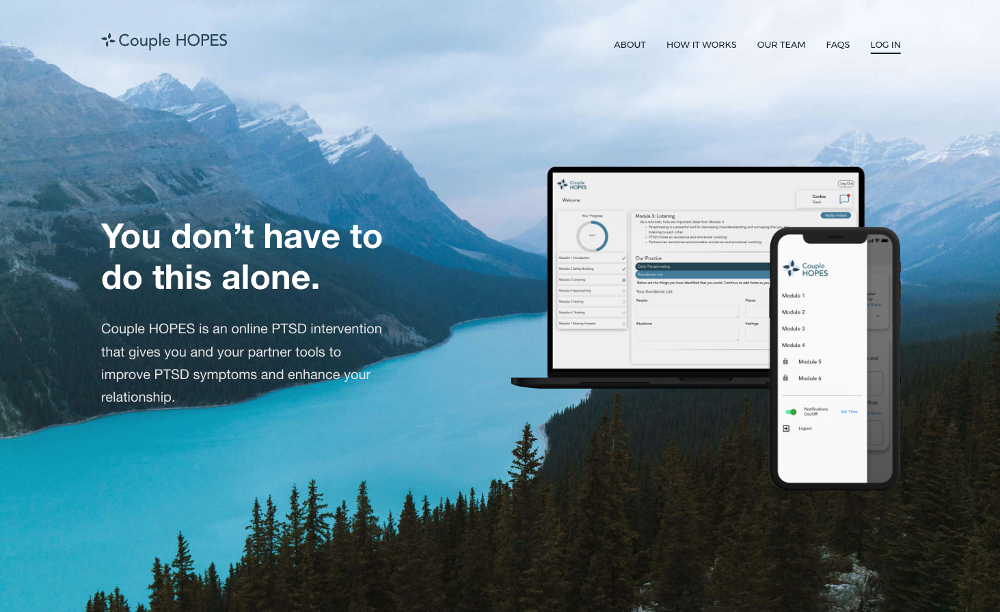

# Website Redesign and Dev

Redesigned and developed the [Couple HOPES](https://couplehopes.com/) website.
{: .fs-6 .fw-300 }

## 📌 Context

As project manager at the [TULiP Lab](https://www.tuliplab.ca/), a large part of my job was to improve the user experience for the online clinical intervetions being studied to make them more engaging and attract new participants. I redesigned, prototyped and developed the pubic-facing website for one of the programs, Couple HOPES, which led to a 20% increase in new users.

## ✨ Highlights

- Redesigned, prototyped and developed a marketing website that led to an increase in new users
- Wrote all content, and sourced all images and graphics for the new website

## 🔗 Links

[Couple HOPES Website](https://couplehopes.com/){:target="_blank"}
