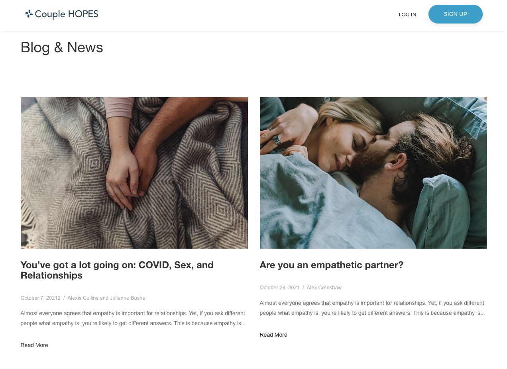

<!-- title: "User Guide: Modifying an InDesign File" -->

# How-to guide for preparing blog posts

Wrote a guide that teaches non-technical users how to prepare blog posts for the [Couple HOPES blog](https://couplehopes.com/static/blog.html).
{: .fs-6 .fw-300 }

## 👩‍💻 Title & Employer

Project Manager @ The [TULiP Lab](https://www.tuliplab.ca/) at York University

## 📌 Context

After designing and developing the [Couple HOPES website](https://couplehopes.com/), I spearheaded the launch of a blog on the website. I pitched ideas, edited blog posts submitted by team members, and formatted the blog posts for publication. My goal was to create content that would both improve the SEO of the website and enhance the brand reputation.

## ✨ Highlights

- Pitched topical blog content ideas with SEO keywords in mind
- Edited blog posts submitted by clinical psychologists and research assistants to ensure complex topics were communicated for non-scientific audiences
- Prepared blog posts as HTML files and delivered images to spec to accompany each post

## 🔗 Links

- [Couple HOPES blog](https://couplehopes.com/static/blog.html)
